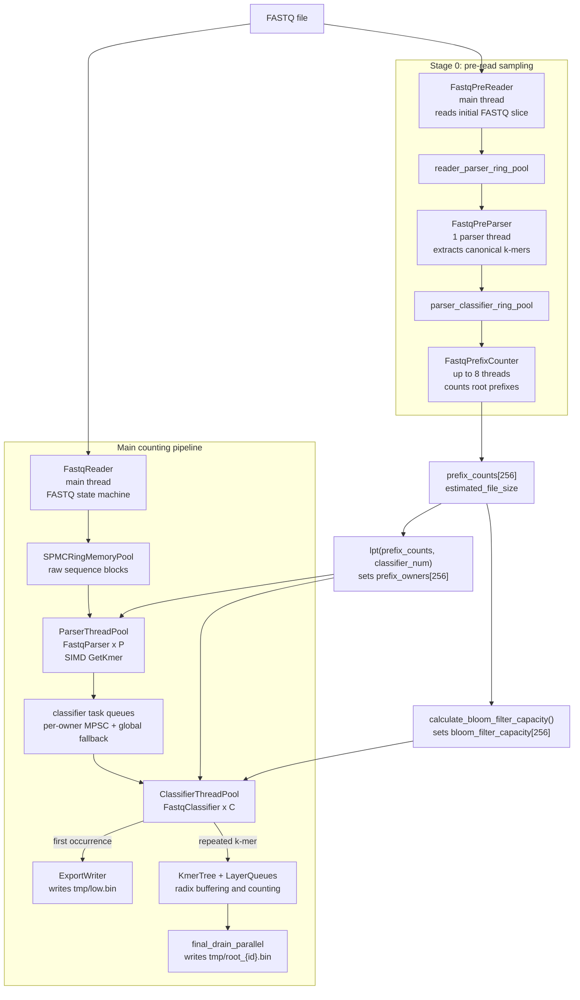
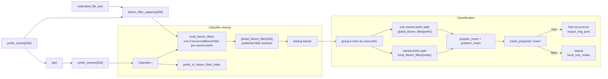
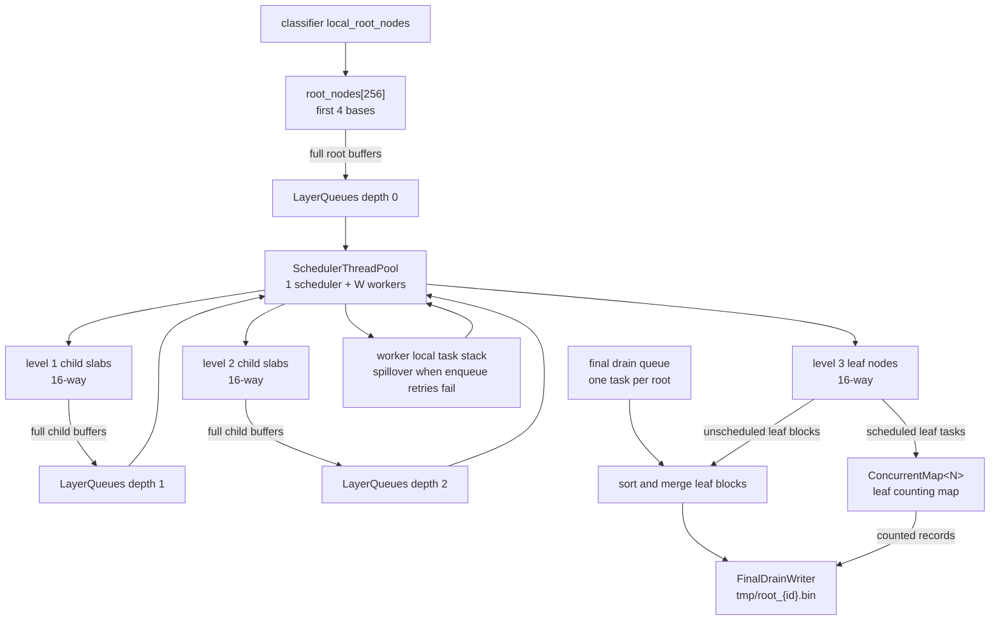

# tree_v4 - High-Performance K-mer Counter

`tree_v4` is a C++20, header-heavy, SIMD-aware k-mer counter for FASTQ data. The current pipeline separates FASTQ reading, SIMD k-mer extraction, prefix-owner routing, bloom-filter first-occurrence detection, radix-tree buffering, adaptive task scheduling, and final per-root export.

The implementation is optimized around fixed-size memory blocks, lock-free or low-contention queues, NUMA-aware allocation, root-prefix load balancing, and early removal of first-occurrence k-mers from the counting path.

## Architecture Overview

The program runs in two major phases:

1. **Stage 0 pre-read sampling** reads an initial FASTQ slice, extracts k-mers, counts the 256 root prefixes, assigns each prefix to a classifier with LPT load balancing, and sizes one bloom filter per root prefix.
2. **Main counting pipeline** reads the full FASTQ file, routes extracted k-mers to classifier owners, exports first occurrences, sends repeats into the radix tree, and drains all remaining buffered/counting state to per-root output files.



## Bloom and Prefix Ownership Pipeline

The latest bloom-filter design is prefix-owner based. Stage 0 produces a sampled count for each 4-base root prefix. `lpt()` sorts prefixes by sampled count and assigns them to classifier threads so that each classifier gets a similar estimated workload. `calculate_bloom_filter_capacity()` estimates total k-mers from file size, scales capacity per prefix by the sampled prefix ratio, rounds to a power of two, and enforces `standard_bloom_filter_capacity`.

Each `FastqClassifier` creates `ConcurrentBloomFilter<N>` instances only for the prefixes it owns. Those local filters are published into `global_bloom_filter[256]` behind a startup barrier. During classification, a thread uses its local filter for owned prefixes and the published global pointer for non-owned prefixes.



## Main Pipeline

### Stage 0: Pre-Read Sampling

- `FastqPreReader<N>` reads the initial FASTQ sample through the same FASTQ state-machine approach used by the main reader.
- `FastqPreParser<N>` extracts canonical k-mers and pushes k-mer blocks through `parser_classifier_ring_pool`.
- `FastqPrefixCounter<N>` consumes those blocks and accumulates 256 root-prefix counters.
- Counts below 1000 are raised before load balancing and capacity estimation, avoiding tiny bloom filters for sparse sampled prefixes.
- `lpt()` assigns root prefixes to classifiers and writes `prefix_owners`.
- `calculate_bloom_filter_capacity()` writes `bloom_filter_capacity`.

### Main Read and Parse

- `FastqReader<N>` runs on the main thread and pushes raw sequence chunks into `reader_parser_ring_pool`.
- `ParserThreadPool<N>` starts `P` parser threads.
- `FastqParser<N>` uses SIMD-backed `GetKmer<N>` to extract canonical k-mers without bloom checks.
- Parsers group buffered k-mers by classifier owner using `prefix_owners`.
- Parsers enqueue owner-specific blocks into per-classifier `MPSCRingQueue` instances and fall back to `global_classifier_task_queue` when needed.

### Classify, Export, and Insert

- `ClassifierThreadPool<N>` starts `C` classifier threads and coordinates the startup barrier for `global_bloom_filter`.
- Each `FastqClassifier<N>` consumes from its private queue first, then the global fallback queue.
- Classifiers regroup each block by root prefix, check the correct `ConcurrentBloomFilter<N>`, and split the block:
  - First occurrence: buffered into `ExportBlock<N>` and sent to `export_ring_pool`.
  - Repeat: compacted into local prefix groups and accumulated in per-thread `local_root_nodes`.
- At shutdown, each classifier flushes local root nodes to the global `KmerTree` and marks one scheduler producer complete.
- `ExportWriter<N>` consumes `export_ring_pool` and writes first occurrences to `tmp/low.bin`.

### Tree Scheduling and Final Drain

`KmerTree<N>` is a 4-depth radix buffering tree. The root layer is indexed by the first 4 bases, then each lower tree level consumes `NODE_BASES` bases. Nodes buffer fixed-size `kmer_block<N>` arrays until they need to be flushed deeper.



The scheduler monitors queue pressure across depths, assigns workers to depths, and lets workers process local spillover stacks to reduce queue contention. `final_drain_parallel()` later walks all roots, inserts remaining leaf blocks where a leaf already has a map, or sorts and merges leaf blocks directly when no map exists.

## Thread Allocation

Thread counts are derived in `main.cpp` after validating `n_thread >= 6`.

```cpp
parser_num = max(1, n_thread / 6);
worker_budget = n_thread - 2 - parser_num; // minus reader and ExportWriter
classifier_num = max(1, worker_budget / (1 + TASK_CLASSIFIER_RATIO));
tasker_num = worker_budget - classifier_num;
```

With the default `TASK_CLASSIFIER_RATIO = 1`, the worker budget is split approximately evenly between classifier threads and scheduler worker threads.

The total active main-pipeline budget is:

```text
1 reader + parser_num + classifier_num + tasker_num + 1 ExportWriter = n_thread
```

Stage 0 also starts one `FastqPreParser` thread and up to 8 `FastqPrefixCounter` threads during initialization.

## Component Map

| File | Role |
|------|------|
| `main.cpp` | CLI validation, stage orchestration, thread-count calculation, pre-read sampling, prefix-owner load balancing, bloom capacity estimation, pipeline startup/join, final drain, timing output. |
| `definition.h` | Shared constants and globals, including ring capacities, tree depth parameters, `Task<N>`, `ExportBlock<N>`, `prefix_owners`, `bloom_filter_capacity`, and `global_bloom_filter`. |
| `kmer.h` | Bit-packed 2-bit/base k-mer representation and fixed-size k-mer blocks. |
| `GetKmer.h` | Canonical k-mer extraction with forward/reverse-complement state and SIMD batch ingestion. |
| `FastqPreReader.h` | Stage 0 FASTQ reader used for prefix sampling and estimated file size. |
| `FastqPreParser.h` | Stage 0 parser that extracts sampled k-mers into the parser/classifier ring pool. |
| `FastqPrefixCounter.h` | Counts sampled k-mers by 256 root prefixes. |
| `FastqReader.h` | Main FASTQ reader with Header -> Sequence -> Plus -> Quality state handling and block output. |
| `FastqParser.h` | Main parser that extracts canonical k-mers, groups them by classifier owner, and dispatches owner-specific blocks. |
| `ParserThreadPool.h` | Starts parser threads, aggregates parser counters, and signals parser/classifier producer completion. |
| `FastqClassifier.h` | Creates per-owned-prefix `ConcurrentBloomFilter` objects, publishes `global_bloom_filter` pointers, classifies first/repeated k-mers, exports first occurrences, and buffers repeats in local root nodes. |
| `ClassifierThreadPool.h` | Starts classifier threads, coordinates the bloom-filter startup barrier, and notifies the scheduler as classifier producers finish. |
| `BloomFilter.h` | Single-threaded `BloomFilter<N>` and concurrent `ConcurrentBloomFilter<N>` using XXH3 128-bit hashing, three bit probes, atomic `fetch_or`, and prepared probe/prefetch helpers. |
| `NewKmerTree.h` | Radix-tree buffering, task creation, worker insertion, leaf map creation, local root flushing, final drain, and export filtering by `min_count`/`max_count`. |
| `LayerQueues.h` | Depth-indexed `MPMCRingQueue<Task<N>>` queues plus final-drain queue and atomic queue-size accounting. |
| `SchedulerThreadPool.h` | Adaptive scheduler and worker pool for draining depth queues into lower tree levels or leaf maps. |
| `ConcurrentMap.h` | Active leaf counting map used by `KmerTree`, with CAS-based bucket insertion and atomic count updates. |
| `ConcurrentCountingHashMap.h` | SIMD-oriented concurrent counting hash map implementation and test target, currently separate from the active `KmerTree` leaf path. |
| `CountingHashMap.h` | Thread-local counting map utility retained for local aggregation paths. |
| `ConcurrentMemoryPool.h` | NUMA-aware block allocator with large-block allocation, thread-local caching, and huge-page support/fallbacks. |
| `RingMemoryPool.h` | Fixed-block ring memory pools, including the SPMC variant for reader-to-parser blocks. |
| `MPSCRingQueue.h` | Multi-producer single-consumer queue used for per-classifier task queues. |
| `MPMCRingQueue.h` | Multi-producer multi-consumer queue used by layer queues and global classifier fallback queue. |
| `ExportWriter.h` | Consumes first-occurrence export blocks and writes `tmp/low.bin`. |
| `FinalDrainWriter.h` | Buffered writer for final per-root outputs in `tmp/root_{id}.bin`. |
| `ExportReader.h` | Utility reader for exported low-frequency files. |
| `SpinLock.h` | TATAS spinlock with backoff/yield behavior and test-mode counters. |
| `HashFunction.h`, `SplitMix.h`, `FixedStack.h`, `FixedMinHeap.h` | Supporting hash, randomization, stack, and heap utilities. |

## Design Highlights

- **Prefix-owner classification**: Sampling assigns all 256 root prefixes to classifier owners before the main pipeline starts, improving cache locality and reducing random cross-thread bloom access.
- **Per-prefix bloom sizing**: Bloom capacity is proportional to sampled prefix frequency and estimated file size, with a minimum standard capacity.
- **Prepared bloom probes**: Classifiers prepare bloom insert probes and prefetch target bins before atomic insertion on larger prefix groups.
- **Two-path k-mer flow**: First occurrences are exported immediately to `tmp/low.bin`; repeated k-mers continue into the radix tree for counting.
- **Queue-aware parsing**: Parsers build owner-specific blocks and prefer private classifier queues, with a global fallback queue for pressure relief.
- **Local aggregation before global tree insertion**: Classifiers buffer repeats in local root nodes and periodically flush into shared root nodes, reducing root contention.
- **Adaptive tree scheduling**: Scheduler workers consume pressure-scored depth queues and use local task stacks for short-term spillover.
- **NUMA-aware memory behavior**: `ConcurrentMemoryPool` uses large mappings, per-node arena concepts, thread-local block caches, and huge-page-friendly allocation paths.
- **Fixed-size block reuse**: Reader/parser/classifier/export paths pass reusable blocks through ring memory pools instead of allocating per record.

## Build and Usage

### Dependencies

- C++20 compiler, tested with modern GCC/Clang-style toolchains.
- CMake 3.10 or newer.
- POSIX threading and realtime libraries (`pthread`, `rt`).
- Optional `libnuma` development headers for NUMA support.
- `libaio` development headers/runtime are required by the asynchronous export writer implementation.
- x86-64 CPU support for AVX2 or SSE4.2 is used when available at compile time.

### Build

```bash
cmake -B build
cmake --build build
```

### Run

```bash
./build/Tree <fastq_file> <k_len> <n_thread> <memory_limit_gb> [map_capacity] [min_count] [max_count] [parser_threads]
```

| Parameter | Description |
|-----------|-------------|
| `fastq_file` | Input FASTQ file path. |
| `k_len` | K-mer length. The shared constants support up to `MAX_K = 128`. |
| `n_thread` | Total main-pipeline thread budget. Must be at least 6. |
| `memory_limit_gb` | Memory budget passed to `ConcurrentMemoryPool`, in GiB. |
| `map_capacity` | Leaf counting map bucket capacity. Default: 1024. Must be greater than 1 and below `16 * 1024 * 1024`. |
| `min_count` | Minimum count exported during final drain. Default: 1. |
| `max_count` | Maximum count exported during final drain. Default: `uint32_t::max`. |
| `parser_threads` | Accepted by the usage string but currently not applied by `main.cpp`; parser count is derived from `n_thread / 6`. |

### Outputs

| Output | Meaning |
|--------|---------|
| `tmp/low.bin` | First-occurrence k-mers emitted directly by classifiers through `ExportWriter`. |
| `tmp/root_{id}.bin` | Final per-root records emitted by `final_drain_parallel()`, after leaf map export or sort/merge of buffered leaf blocks. |

### Tests

```bash
ctest --test-dir build
```

The current CMake file registers tests for the active concurrent map implementations.
